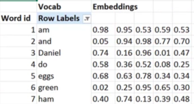

# Natural Language Processing (NLP)

## Word Embeddings

We represent words as vectors.

This example each word is represent by a vector of 5 numbers.

Vectors  normally range from sizes of 50-200 numbers. This allows words to have more meaning and relationships between other words

Some pre-trained embbedings are [Word2Vec](https://deeplearning4j.org/word2vec.html) and [Glove](https://nlp.stanford.edu/projects/glove/)

## Language modelling

a model that can predict the next word in a sentence given a few words of a sentence

torch text is pytroches nlp

Tokenization breaks words into tokens.
